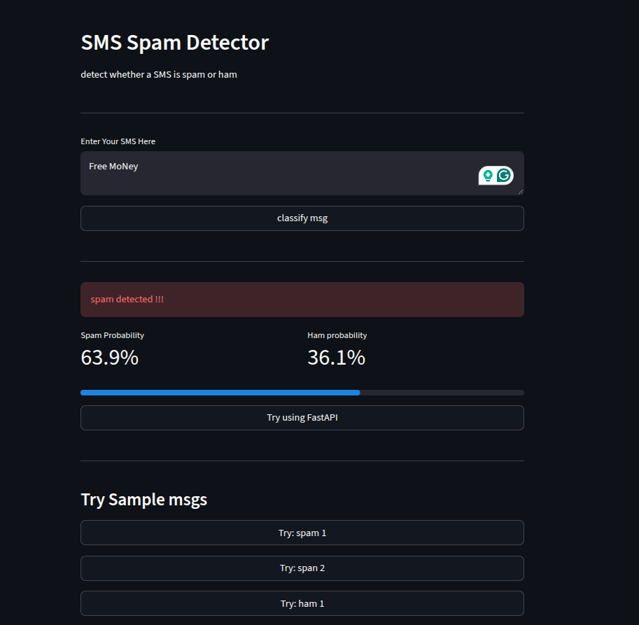

# ⚠️ Spam Detector API

I am using Logistic Regression and TfidfVectorizer.
**Recall for spam is 0.91, and Recall for Ham is 0.98.** 
**and Accuracy is 97.50%** 

## Live Demo

- **Live UI =** https://sms-spam-detector-avyakta.streamlit.app
- **API =** https://sms-spam-detector-zr4c.onrender.com/docs
-  **Dataset Used =**  https://raw.githubusercontent.com/justmarkham/pycon-2016-tutorial/refs/heads/master/data/sms.tsv

## Model Performance 

**Accuracy - 97.50%**   
### Model Performance


| Class | Precision | Recall | F1-Score | Support |
| :--- | :--- | :--- | :--- | :--- |
| **0 (Ham)** | 0.99 | 0.98 | 0.99 | 966 |
| **1 (Spam)** | 0.90 | 0.91 | 0.91 | 149 |
| **Accuracy** | | | **0.97** | **1115** |
| **Macro Avg** | 0.94 | 0.95 | 0.95 | 1115 |
| **Weighted Avg** | 0.98 | 0.97 | 0.97 | 1115 |


## Tech Stack 
- python, FastAPI, Scikit-Learn, Streamlit
- TF - IDF Vectorizer, Multinomial naive bayes
- Deployed on Render + Streamlit Cloud 

## Run Locally
- *1st Command:* pip install -r requirements.txt
- *2nd Command:* python train.py
- *3rd Command:* uvicorn main:app --reload
- *4th Command:* streamlit run app.py 

## API Usage
Post /Predict

**Request**
```json
{
   "textsms": "Free Money"
}
```

**Response**
```json
{
  "prediction": "Spam",
  "probability": 0.713899609605925
}
```

## UI Screenshot


# Spread Love ❤ 